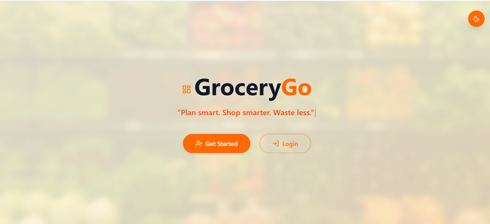
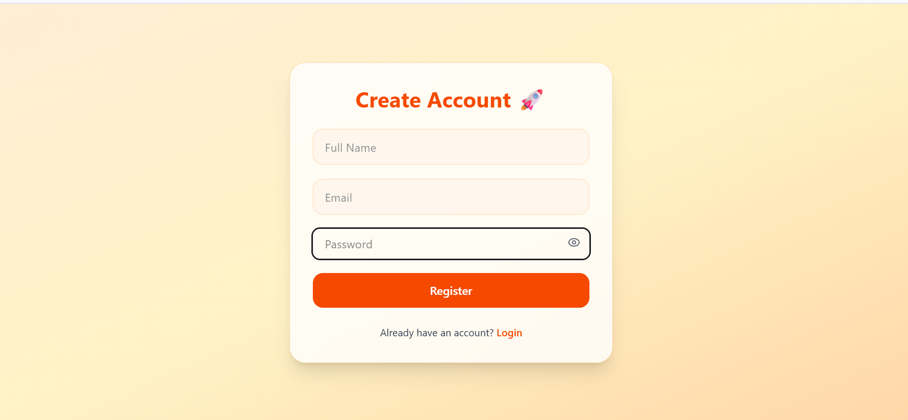
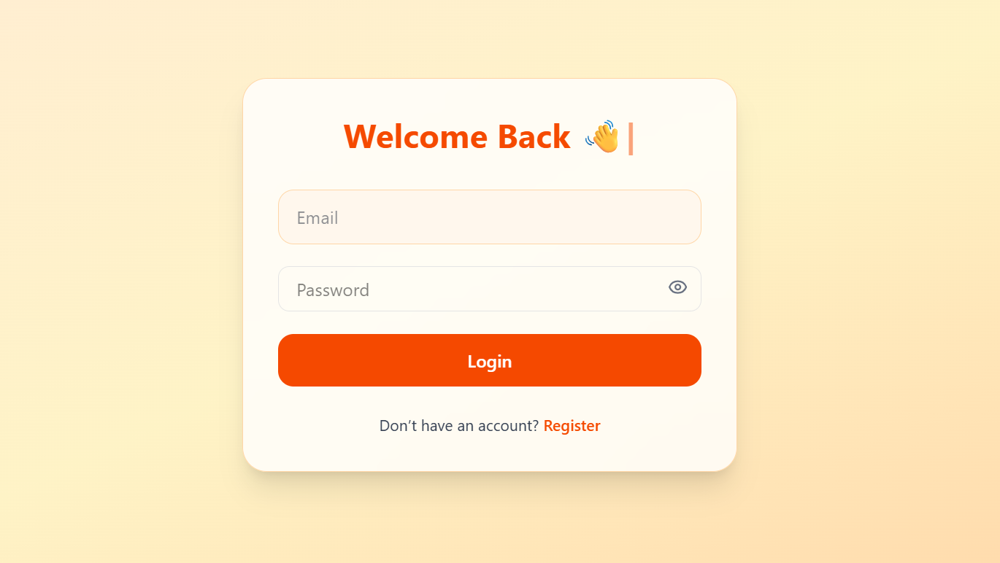
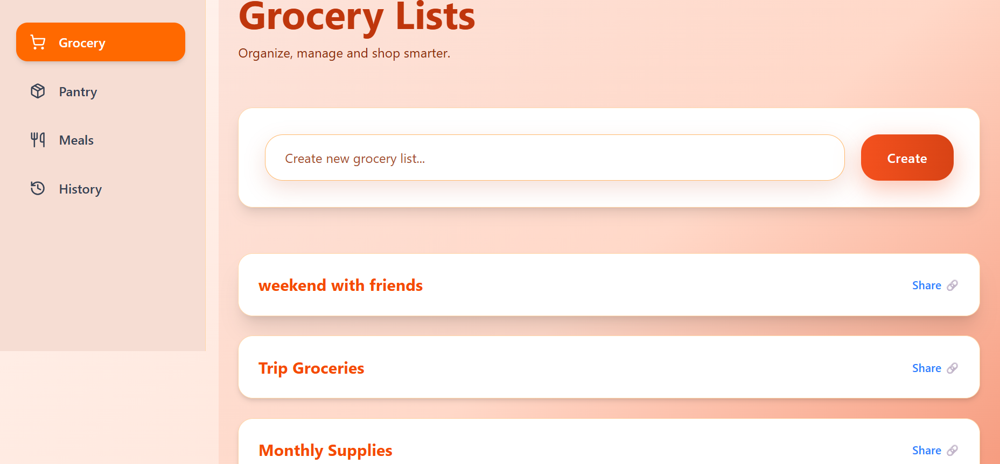
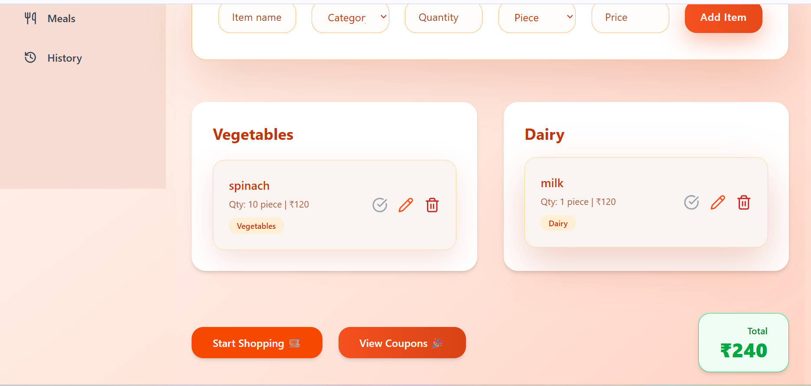
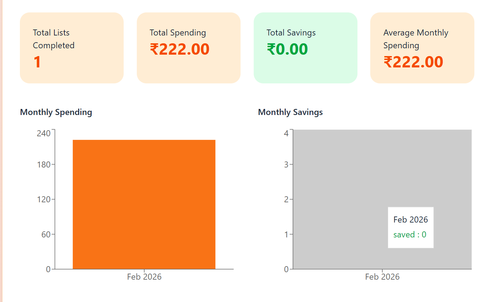

🛒 Grocery List Manager – Frontend
📌 Project Title

Grocery List Manager – Smart Grocery Planning Application

**📖 Project Description**

The Grocery List Manager is a full-stack web application developed to simplify grocery shopping, reduce food waste, and improve budget management.

This frontend application is built using React.js and provides an interactive user interface for managing grocery lists, pantry inventory, meal planning, shopping mode, budget tracking, and nutrition analytics.

The frontend is fully integrated with a Node.js + Express backend and Supabase (PostgreSQL) database, ensuring proper data storage, authentication, and real-time updates.

**✨ Features**

🔐 User Authentication (Register & Login with JWT)

🛒 Create and Manage Grocery Lists

🥫 Pantry Management with Expiry Tracking

🍽 Meal Planning and Suggestions

💰 Budget Tracking and Spending Overview

🛍 Shopping Mode with Real-time Bill Calculation

📊 Nutrition Dashboard (Calories & Macro Charts)

📜 Shopping History Tracking

🛠 Tech Stack Used

⚛️ React (Vite)

🎨 Tailwind CSS

🧩 ShadCN UI

🔗 Axios (API Communication)

🧠 Context API (State Management)

📊 Recharts (Data Visualization)

📂 Folder Structure

The project follows the required clean and modular structure:

src/
│
├── components/
├── pages/
├── context/
├── services/
├── hooks/
├── utils/
└── App.jsx

All API calls are handled inside the services folder using Axios.
State management is implemented using Context API.

**🔗 Integration**

Frontend is properly integrated with:

Backend (Node.js + Express) deployed on Render

Supabase Database (PostgreSQL)

API Base URL:
https://backend-grocery-19nr.onrender.com/api

⚙️ Installation Steps
Clone the Repository
git clone :https://github.com/Divyasree-Manpoor/frontend-grocery
cd frontend-grocery
Install Dependencies
npm install
Start Development Server
npm run dev

Frontend deployed on Netlify.

🔗 Live Link:  Netlify link here
🔗 Backend API: https://backend-grocery-19nr.onrender.com

LandingPage
This page introduces the app and lets users go to login or register.

RegisterPage
This page allows new users to create an account.

LoginPage
This page allows users to log in to their account.

Dashboard
This page shows a summary of grocery activity and spending.

grocerysharing.png
This page allows users to create and manage their grocery list.

ShoopingPage
This page helps users track purchased items and calculate the total bill.

PantryPage
This page helps users track pantry items and expiry dates.

meal
This page allows users to plan meals and see suggestions.

HistoryPage
This page shows past shopping records and spending details.

